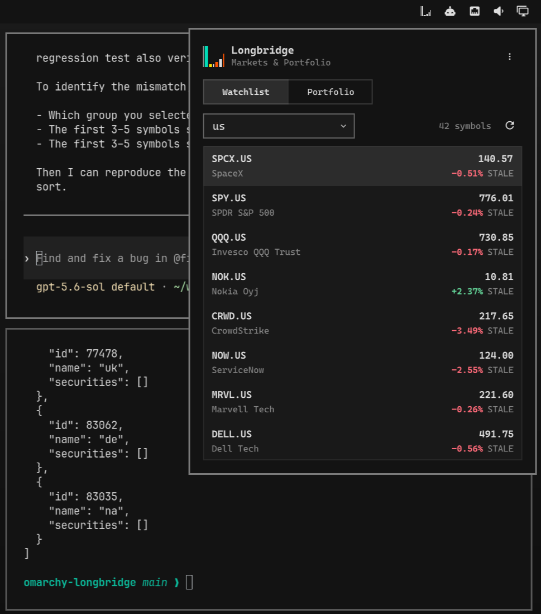

# Longbridge for Omarchy

A compact Omarchy watchlist and Longbridge portfolio panel.

The Watchlist loads your authenticated Longbridge groups and Longbridge prices. The Portfolio tab uses Longbridge Terminal for account data.



## Requirements

- Omarchy
- Longbridge Terminal available on `PATH`
- Internet access

Longbridge Terminal and a verified login are mandatory before the normal panel opens. The plugin welcome page verifies installation and login, and can guide recovery. There is no skip action.

## Install

Add and enable the plugin:

```bash
omarchy plugin add https://github.com/longbridge/omarchy-longbridge.git --enable
```

Open Longbridge from the bar. The welcome page will:

1. Check whether Longbridge Terminal is installed.
2. Offer **Install Longbridge CLI** when it is missing.
3. Offer **Log in to Longbridge** after installation.
4. Verify the session with `longbridge check --format json`.

The install action runs the official command only after you click it:

```bash
curl -sSL https://github.com/longbridge/longbridge-terminal/raw/main/install | sh
```

See the [Longbridge CLI documentation](https://open.longbridge.com/docs/cli/) for manual installation and troubleshooting.

For development, symlink this checkout into Omarchy:

```bash
./install.sh
```

Use `./install.sh --no-restart` to leave the current shell running. This script validates and links the plugin; it never installs Longbridge Terminal automatically.

## Watchlist

The compact Watchlist reads every group returned by `longbridge watchlist --format json`. Its group dropdown includes `all`, `holdings`, and custom groups in Longbridge order. The selected group is read-only; edit membership in Longbridge Terminal or another Longbridge client.

After loading membership, the plugin fetches prices with `longbridge quote … --format json`. It refreshes when the panel opens, when requested, and every five minutes while the Watchlist tab is active. Failures retain the last available membership and prices.

Each 44-unit row shows the symbol, name, price, currency, and percentage movement. Selecting a row opens OHLC, volume, session, timestamp, and removal details.

## Portfolio

Portfolio runs exactly:

```text
longbridge portfolio --format json
```

It refreshes when selected, on explicit refresh, and every 60 seconds while visible. The summary stays compact while holdings use a bounded list with its own scrollbar. Each 44-unit row shows market value and today's movement; quantity, available quantity, market price, average cost, total P/L, and currency appear in selected-row detail.

## Resource menu

The top-right menu opens:

- [Longbridge](https://longbridge.com)
- [Longbridge CLI](https://open.longbridge.com/docs/cli/)
- [GitHub](https://github.com/longbridge/omarchy-longbridge)

It has no exit or destructive actions.

## Keyboard controls

- `J` / `K` or arrow keys: move selection
- `Enter`: open selected detail
- `A`: open the add-symbol control
- `X`: remove the selected watchlist symbol
- `R`: refresh the active tab
- `W` / `M`: switch to Watchlist
- `P`: switch to Portfolio
- `Esc`: return from detail or close the panel

## Privacy and data sources

The plugin does not read or copy Longbridge OAuth files. Setup, Watchlist, quotes, and Portfolio launch the installed CLI, which owns authentication and account access. The Watchlist exposes no mutation commands. No trading or order placement is implemented.

Red and green are reserved for rise/fall text. Icons, surfaces, selection, and borders remain theme-neutral; only the official logo in the panel header uses brand colors.

## Development

Run all checks with:

```bash
make validate
```

Automated tests use fixtures and fake executables. They do not contact Longbridge or read OAuth files.

## Update or remove

```bash
omarchy plugin update longbridge.omarchy
omarchy plugin remove longbridge.omarchy
```

Removing the plugin does not remove Longbridge Terminal or its login.

## Limitations

- Read-only; no order placement.
- Watchlist data is polled and may be delayed, interrupted, or unavailable.
- No historical portfolio chart.

Longbridge for Omarchy is not investment advice.

## License

Apache-2.0. Longbridge Terminal is distributed separately.
